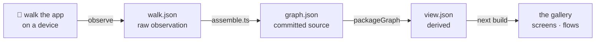
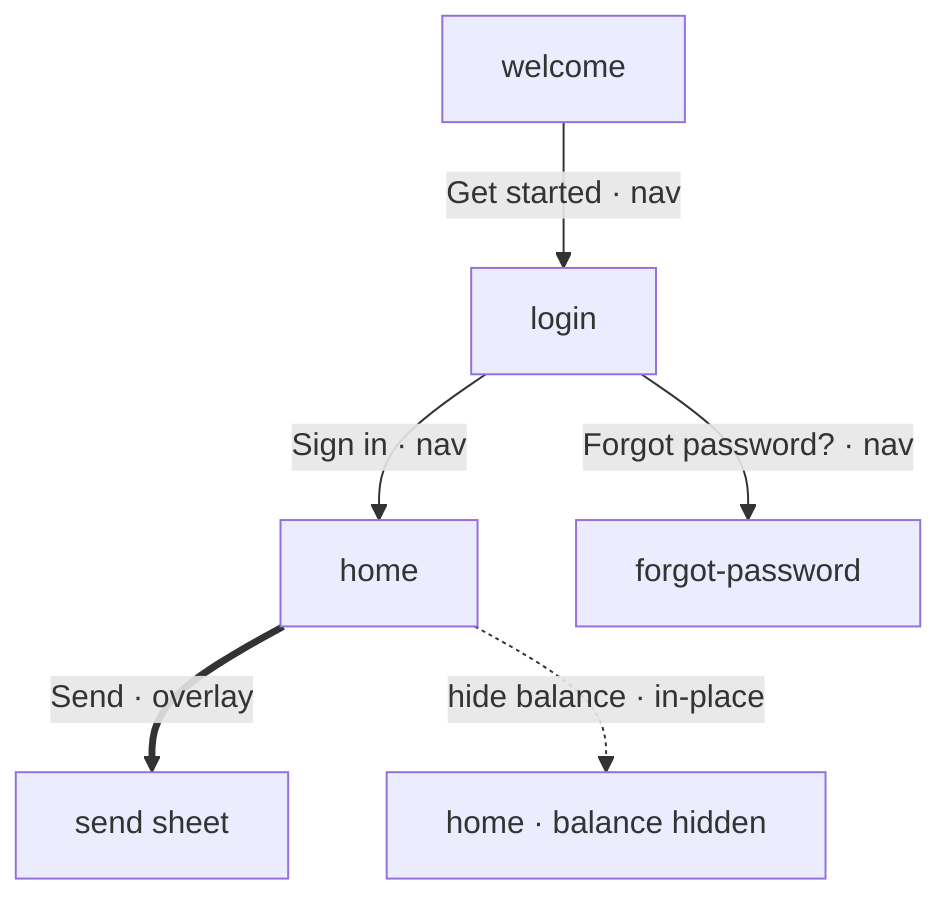
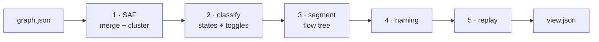
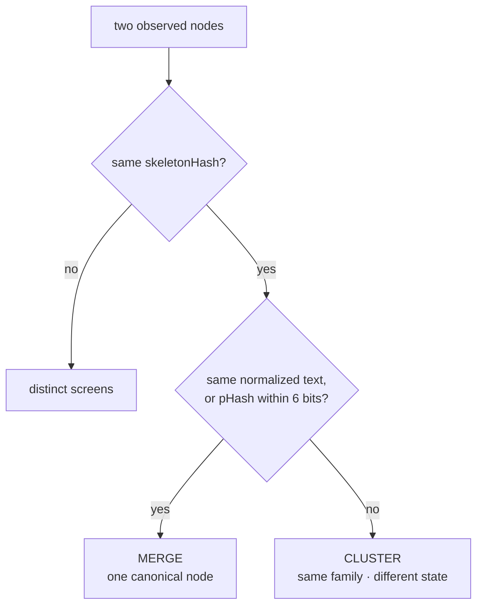
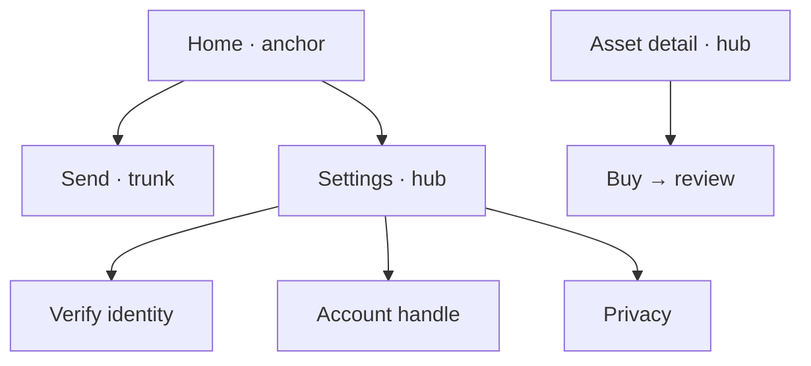
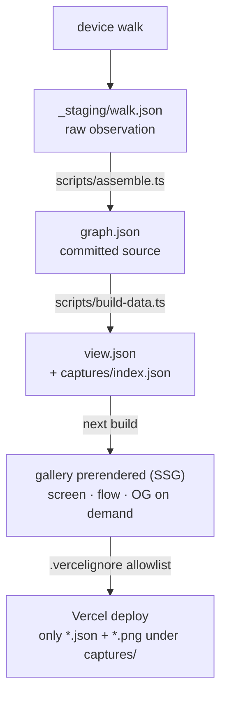
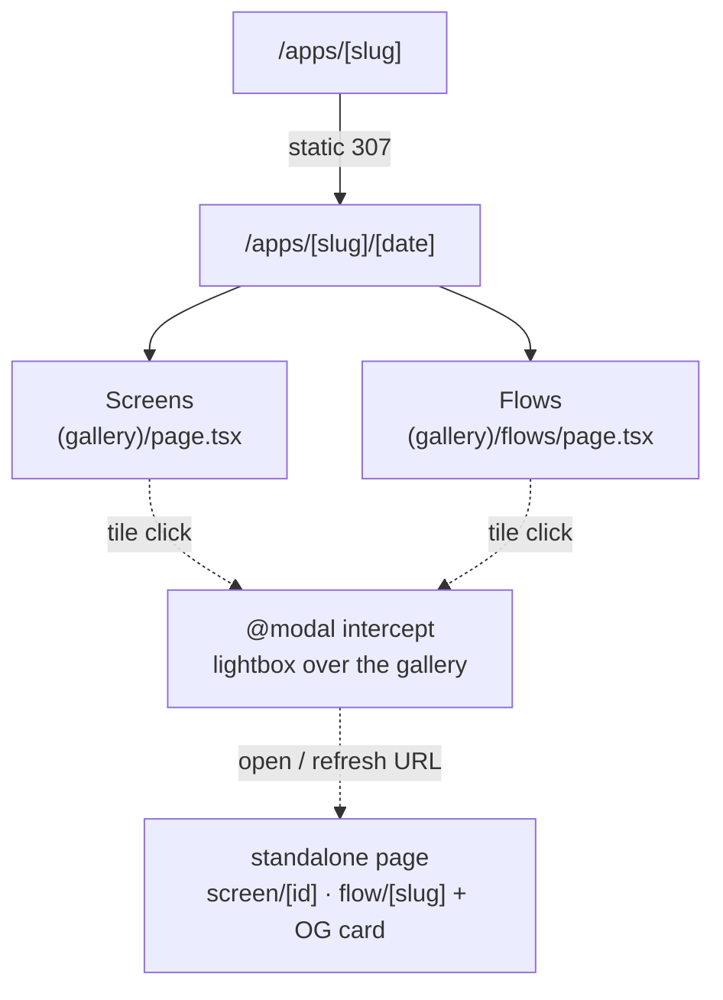

# Wallets Gallery

A website that publishes **captured UI flows** from mobile crypto-wallet and fintech apps.
Each app is walked once on a device, its screens and transitions are recorded as a single
graph, and everything the site shows — merged screens, named flows, state variants, and
replayable scripts — is **derived deterministically from that one graph**.

The website is the easy part. The interesting part is the **capture model**: one committed
`graph.json` per capture, plus a pure function that turns it into everything you browse. This
README explains both — how the repo is laid out, and how a capture becomes a gallery.



> This README **describes** the codebase. The rules for working in it — editing discipline,
> the determinism contract, commit and versioning conventions — live in [`CLAUDE.md`](CLAUDE.md).

---

## Contents

1. [What it is](#what-it-is)
2. [Quick start](#quick-start)
3. [Repository layout](#repository-layout)
4. [The capture model](#the-capture-model) — nodes, edges, graphs
5. [Screen identity](#screen-identity) — when are two screenshots "the same screen"?
6. [The packager: graph → view](#the-packager-graph--view) — the five stages
7. [Overrides](#overrides) — the one hand-edited surface
8. [Build & deploy](#build--deploy)
9. [Routes & rendering](#routes--rendering)
10. [Capturing a new app](#capturing-a-new-app)

---

## What it is

Three moving parts, plus the tool that makes the data:

- **The app** — a Next.js 16 / React 19 site (Tailwind v4 + shadcn/ui) on Vercel. Home and
  gallery pages are prerendered from JSON on disk (SSG); individual screen/flow pages, their
  Open Graph cards, and image optimization happen on demand. There are **no external data
  fetches** — everything comes from local JSON.
- **The data** — under `public/captures/`, one directory per app. Each capture is a
  `graph.json` (the committed source of truth) plus a generated `view.json`.
- **The engine** — `lib/packager/`, a pure function `packageGraph(graph) → view`. Same graph
  in, byte-identical view out, every time.
- **The capture agent** — `.claude/skills/app-capture/`, the playbook an agent follows to walk
  an app and produce a `graph.json`. You don't need it to run the site; it's how new data is made.

The whole model in one line:

```
observe a walk  →  assemble a graph  →  derive a view  →  render the gallery
```

Everything downstream of `graph.json` is computed. Change the graph, re-run the packager, and
the gallery updates. Nothing about a screen, flow, or replay is written by hand except a small
`overrides` block (see [Overrides](#overrides)).

---

## Quick start

Uses **pnpm**. TypeScript build scripts run directly on Node (≥ 22 runs `.ts` natively — no
ts-node step).

```bash
pnpm install

pnpm dev          # next dev (turbopack) — local dev server
pnpm build-data   # regenerate every view.json + the captures registry from graph.json
pnpm build        # build-data → next build
pnpm start        # run the production server locally
pnpm test         # vitest (unit + packager tests)
pnpm typecheck    # tsc --noEmit
pnpm lint         # eslint
```

`pnpm build` is the full pipeline. `pnpm build-data` is the fast inner loop when you've only
touched a `graph.json` or the packager.

---

## Repository layout

```
app/                          # Next.js App Router (gallery prerendered; screen/flow on demand)
  page.tsx                    #   /            browse grid (reads public/captures/index.json)
  apps/[slug]/                #   /apps/x      static 307 → /apps/x/<latest>
    [date]/                   #   /apps/x/<date>   the one canonical capture tree
      (gallery)/page.tsx      #     Screens tab · (gallery)/flows/page.tsx for Flows
      @modal/                 #     intercepting-route modals (lightbox over the gallery)
      screen/[id] · flow/[slug]  # standalone pages + opengraph-image.tsx (shared links / SEO)
  llms.txt/route.ts           #   /llms.txt    machine-readable index of apps + data URLs

components/
  app-detail/  browse/        # per-app detail UI (tabs, grids, rows); the browse grid + sort
  lightbox/  standalone/      # screen/flow viewers, as modals and as full pages
  shared/  layout/  ui/        # image actions; app shell + header; shadcn primitives

lib/
  packager/                   # ★ THE ENGINE — graph → view. Pure, deterministic.
    types.ts                  #   full type contract for graph + view (read this first)
    index.ts                  #   packageGraph(graph): View — orchestrates the five stages
    identity.ts               #   fingerprint / skeletonHash / pHash primitives
    saf.ts                    #   stage 1: merge + cluster raw nodes
    classify.ts               #   stage 2: state labels + in-place toggle detection
    segment.ts                #   stage 3: build the flow tree
    naming.ts  replay.ts      #   stage 4: flow names · stage 5: inline .ad replay scripts
    graph.ts  validate.ts     #   adjacency helpers; graph.json validator
  captures.ts                 # server-only reads of index.json + view.json (all routes share)
  links.ts  states.ts         # route/deep-link helpers (captureBase); state switcher UI
  images.ts  og.tsx           # screenshot URLs; Open Graph card renderers (logo/avatar mark)
  app-logo.ts                 # appAvatarSrc(slug, logo): committed logo.png, else generated avatar
  types.ts  site.ts  utils.ts # app-facing types; site URLs; helpers

scripts/                      # build-time CLIs (intentionally prettier-off, dense style)
  assemble.ts                 #   walk.json → graph.json  (computes identity signals, validates)
  package.ts                  #   graph.json → view       (CLI wrapper around the packager)
  build-data.ts               #   every graph.json → view.json + the captures registry
  phash.ts                    #   dependency-free perceptual hash of a PNG

public/captures/              # ★ THE DATA
  index.json                  #   generated registry (the browse page reads this)
  <app-slug>/
    app.json                  #   manifest: metadata + capture history + latest pointer
    logo.png                  #   optional brand logo; overrides the generated avatar
    assets/<sha>.png          #   content-addressed screenshots (deduped)
    <YYYY-MM-DD>/graph.json   #   ★ the capture — source of truth (committed)
    <YYYY-MM-DD>/view.json    #   generated by the packager (build artifact)

.claude/skills/app-capture/   # the capture agent's playbook (how graph.json is produced)
tests/                        # vitest: lib utils + tests/packaging/ (assemble, classify, packager)
```

---

## The capture model

A **capture** is one observation of one app at one moment, recorded as a directed graph. It
has exactly four kinds of thing: **nodes** (screen states), **edges** (transitions),
**decision points** (branches), and the **graph** that holds them.



<sub>A toy capture. Solid arrows are `nav` (a different screen); the thick arrow is an
`overlay` (a sheet over the prior screen); the dotted self-return is an `in-place` state
toggle. The packager turns this into merged screens, a flow tree, and replay scripts.</sub>

### Node — one screen in one state

A `GraphNode` is *this* screen with *these* texts and buttons — not "the trade screen"
abstractly. Two states of the trade screen (empty vs. funded) are two nodes; the packager
decides later whether to merge or group them.

```jsonc
{
  "id": "welcome",                            // stable, agent-assigned, human-readable
  "fingerprint": "sha256:9cade6c…",           // exact identity  (see Screen identity)
  "skeletonHash": "sk:7c6bc5a2…",             // structure-only identity
  "pHash": "p:0d782bfe…",                     // perceptual hash of the screenshot
  "role": "other",                            // home|list|picker|form|confirmation|auth|modal|settings|error|other
  "screenshotPath": "assets/cd4f6196.png",
  "texts": ["The card that might not charge you", "Get started", …],
  "interactiveElements": [
    { "label": "Get started", "role": "button", "selector": "label=\"Get started\"", "emphasis": "primary" }
  ]
}
```

- **`texts`** — the visible copy. Drives screen titles and state labels.
- **`interactiveElements`** — the hittable controls. `emphasis: "primary"` tags the screen's
  main call-to-action; it's presentation only and doesn't affect identity.
- **`role`** — a coarse category used by segmentation (e.g. `home` screens act as flow anchors).

### Edge — a transition

A `GraphEdge` is a directed step: "from this screen, this action got me to that screen."

```jsonc
{
  "from": "login",
  "to": "forgot-password",
  "action": "Tap \"Forgot password?\"",       // human-readable
  "selector": "label=\"Forgot password?\"",   // how to re-trigger it (drives replay), or null
  "kind": "nav",                              // nav | overlay | in-place | back
  "observedAtStep": 3                          // walk order; deterministic tie-break
}
```

`kind` is the load-bearing field:

| kind       | meaning                                                    | how it's set                                |
| ---------- | ---------------------------------------------------------- | ------------------------------------------- |
| `nav`      | navigated to a **different** screen                        | derived: `from`/`to` have different skeletons |
| `in-place` | same screen, **changed state** (a "Max" toggle, a swipe)   | derived: `from`/`to` share a `skeletonHash` |
| `overlay`  | a sheet/modal opened **over** the prior screen             | recorded by the agent                       |
| `back`     | pressed the system/back affordance                         | recorded by the agent                       |

The key one is **`in-place`**. It's the deterministic signal that two nodes are one logical
screen in different states — so the packager folds them into a state switcher instead of two
separate flow steps. `nav` vs. `in-place` is *derived* from skeleton equality at assemble time;
the agent only records what skeletons can't detect (`back` and `overlay`).

### Decision point — a branch

Records that a screen offers a real choice, and which options were explored. Each surfaces in
the UI as "this screen branches", linking every option to the flow it leads to.

```jsonc
{
  "nodeId": "login",
  "options": [
    { "label": "Sign in",          "explored": true, "toNode": "home" },
    { "label": "Forgot password?", "explored": true, "toNode": "forgot-password" }
  ]
}
```

### Graph — the whole capture

```jsonc
{
  "meta": { "schemaVersion": 2, "app": {…}, "captureDate": "2026-06-05", … },
  "root": "welcome",                  // the launch node — where the walk started
  "mainNav": ["home", "earn", …],     // optional: top-level sections (tab bar / nav rail)
  "nodes": [ … ],
  "edges": [ … ],
  "decisionPoints": [ … ],
  "overrides": { … }                  // the ONLY hand-edited block (see below)
}
```

`root` is where segmentation roots the flow tree. Each entry in `mainNav` becomes a **top-level
flow that roots its own subtree**, so "Settings" is a peer section rather than a child of
"Home". That's the entire on-disk contract — everything the gallery shows is computed from it.

---

## Screen identity

The hard problem in a capture is: **are these two screenshots the same screen?** A list with 3
rows and the same list with 4 rows are the same. An empty wallet and a funded wallet are the
same screen in two *states*. The trade screen and the settings screen are not. To answer this
deterministically, every node carries **three** independent signals, all computed once at
capture time by `scripts/assemble.ts` — never hand-written, never recomputed by the packager.

| Signal            | What it hashes                                       | Answers                                     |
| ----------------- | ---------------------------------------------------- | ------------------------------------------- |
| **`fingerprint`** | sorted `(role, label)` pairs of interactive elements | "exactly the same controls?" — exact identity |
| **`skeletonHash`**| structure only — element **roles**, labels stripped  | "same *shape* of screen?" — clusters variants |
| **`pHash`**       | a 64-bit perceptual hash of the screenshot pixels    | "do these *look* nearly identical?"          |

Three, because each fails on its own:

- **`fingerprint`** is too strict to merge with — a "Send" button labelled with one recipient's
  name differs from another's, yet it's the same screen. It's the canonical *exact* identity.
- **`skeletonHash`** strips volatile labels, so "…purchase of VIRTUAL" and "…purchase of ETH"
  share one hash. It's deliberately coarse — unrelated screens can collide — so it's never
  trusted alone to merge. (The same hash also drives the `in-place` edge derivation.)
- **`pHash`** compares actual pixels, and guards a merge: two nodes with the same skeleton are
  only collapsed when their pixels are within 6 of 64 bits (`pHashDistance`).

**Graceful degradation.** For a secure screen with no usable screenshot, or a screen with no
interactive elements, the signals fall back to text-based variants (a `sha256-text:`
fingerprint, an `skt:` text skeleton, a `null` pHash). Dynamic content — money amounts,
`@handles`, timestamps, hex addresses, bare numbers, percentages — is normalized to typed
placeholders (`{money}`, `{handle}`, …) before hashing, so data churn doesn't fragment identity.

---

## The packager: graph → view

`lib/packager/index.ts → packageGraph(graph): View` is the heart of the system. It's a **pure,
deterministic** function — no I/O, no randomness, no clock, no dependence on array order. The
same graph always produces the same view. It runs five stages in order:



### Stage 1 — SAF: collapse raw nodes into logical screens

The walk records a fresh node every time the screen changes *at all* — including when only the
data changed. The Screen Abstraction Function fixes that with two operations:

- **Merge** — nodes that are the *same screen state* differing only in data (3 rows vs. 4, one
  token name vs. another). Collapsed into **one canonical node**.
  Rule: same skeleton **and** (same normalized text **or** pixels within 6/64 bits).
- **Cluster** — canonical nodes that are the same logical screen in a *genuinely different
  state* (home empty vs. funded). Kept as **distinct** nodes, but grouped into a **family**.
  Rule: same skeleton.



When nodes merge, the richest one wins as the representative — most elements, then most texts,
then lexically-smallest id. This is where "a list with N rows" stops being N separate screens.

### Stage 2 — classify: label states, fold in toggles

Two jobs on the families from stage 1:

1. **Label each state** — `default` / `empty` / `loading` / `error` / `max`, read from the
   screen's text by narrow, generic regexes (these match UI-state words, not app vocabulary).
2. **Detect in-place toggles** — members joined to the family's default by a *chain* of
   `in-place` edges are the same screen in a different data/condition. They fold into the
   default's **`stateGroup`** and render as an on-screen state switcher, not separate steps.
   (The chain matters: a carousel's slide 3 connects through slide 2, never straight to slide 1.)

### Stage 3 — segment: build the flow tree

This is where journeys come from, and it's the cleverest stage. **The flow tree is the
dominator tree** of the app's nav/overlay graph.

In plain English: a journey nests under the one screen you *must* pass through to reach it. To
get to "Send" you must go through "Home", so "Send" nests under "Home"; "Privacy" nests under
"Settings". From that single rule, the tree shape falls out:

- A screen leading to exactly **one** onward screen is a **trunk** — a step in a flow.
- A screen leading to **2+** onward screens is a **hub** — each branch starts a child flow.
- **Anchors** root their own top-level flow. Three sources are unioned: entry points (the launch
  root + screens nothing navigates to), completion hubs (home/launch screens), and main-nav
  sections (`graph.mainNav`).



<sub>A slice of a resulting flow tree. `Settings` and `Asset detail` are hubs; `Send` is a
one-child trunk; `Home` roots its own subtree.</sub>

A few shapes get special handling so the tree stays clean:

- **Excursions** — a picker/peek sheet opened from a trunk that only pops back to it. It doesn't
  branch the trunk; it's woven inline as a **picker step**.
- **Sheets are steps.** A forward-only confirmation/info overlay is just a normal step. A sheet
  reached from several flows is emitted once, at their common dominator — never duplicated.
- **Cross-section journeys** — reachable from N sections (e.g. "Adding money" from both Home and
  Earn). Instead of hoisting to the top, a copy is re-emitted under **each** reaching section.

Sibling order is deterministic: authored `decisionPoints` order first, then observed-walk order,
then lexical id. The dominator computation is order-independent, so the whole stage is
deterministic. Out comes a tree of journeys, each an ordered list of step nodes.

### Stage 4 — naming

Each flow gets a **mechanical** name from its first distinctive screen's title. That's a
*fallback*: the mechanical name is pushed into **`namingTODO`** so a human or the capture agent
can supply a real one. Authored names persist in `overrides.flowNames`, keyed by the flow's
**name key** — its first distinctive screen. Keying on the stable entry side (not the routing
slug) means cross-section copies share one authored name and a churning goal screen can't
detach it.

### Stage 5 — replay

Each flow's woven steps compile into an inline **`.ad` command script** — `open <bundleId>`,
then `click <selector>` per step — with a confidence rating from selector quality (`id=` beats
`label=`/`role=` beats positional). A picker step expands to two clicks (open the picker, then
make the selection that returns). This is what lets a flow be **re-run on a device**, not just
viewed.

### The result: `view.json`

```jsonc
{
  "app": {…}, "captureDate": "…",
  "screens": [ /* one per canonical node: state/stateGroup + which flows it appears in */ ],
  "flows":   [ /* the journey tree: slug, name, parent, ordered steps (kind: forward|picker), replay */ ],
  "decisionPoints": [ … ],
  "stats": { "screens": N, "rawNodes": M, "flows": F, "topLevelFlows": T, "replayCoverage": 87, "truncatedFlows": 0 },
  "namingTODO": [ /* each: { entryNodeId, nameKey, slug, mechanicalName, steps } */ ],
  "uncapturedSections": [ /* main-nav sections that had no reachable nodes in this walk */ ]
}
```

`view.json` is a **build artifact** — regenerated from the graph and its overrides. To change
anything in it, change the source.

---

## Overrides

The observation part of a graph (nodes / edges / decisionPoints) comes from the walk. The
**only** hand-editable block is `overrides` — written by an edit agent or a person, and carried
forward verbatim across re-captures. Each key corrects exactly one thing the packager derived:

| Key         | Shape                                                            | Corrects                                                     |
| ----------- | ---------------------------------------------------------------- | ------------------------------------------------------------ |
| `flowNames` | name-key → name                                                  | the name of a derived flow (key = its `nameKey`, `steps[1]`) |
| `structure` | flow-id → `{ parent? }`                                          | re-parent a flow (`parent: null` pins it top-level)          |
| `screens`   | node-id → `{ role?, title?, description?, state?, stateGroup? }` | a screen's facts, incl. forcing its state / group            |
| `merges`    | `string[][]`                                                     | force-merge nodes the SAF kept separate                      |
| `splits`    | `string[]`                                                       | force-keep nodes distinct that the SAF would merge           |

Re-running `pnpm build-data` (or `node scripts/package.ts <graph.json>`) applies them. Because
everything else is derived, an override is a small, reviewable correction — not a rewrite of the
output.

---

## Build & deploy



- **`graph.json` is the only committed source per capture.** `view.json` and `index.json` are
  build artifacts, generated by `build-data` and committed in sync with their source.
- **Routes are data, not fetches.** Every gallery page is prerendered from local JSON; screen
  and flow pages render on first request and cache. Nothing fetches from a network.
- **Leak prevention is `.vercelignore`, an allowlist.** Only `*.json` and `*.png` under
  `public/captures/` ship. Raw snapshots, staging dirs, credentials, and editor cruft stay out
  by default — a new stray file type can't leak unless it's explicitly allowed.

---

## Routes & rendering

Every capture is canonical at one **dated** URL. The bare `/apps/<slug>` is a static 307 to the
latest date. The Screens and Flows tabs are separate prerendered pages. Clicking a screen or
flow opens a lightbox via an intercepting `@modal` route; opening that same URL directly (or
refreshing) renders a standalone page with its own Open Graph card.



- **Tabs are routes, not client state.** Each is its own prerendered page under the `(gallery)`
  route group, sharing chrome via `[date]/(gallery)/layout.tsx`. Switching tabs is a prefetched
  soft-nav that swaps only the panel beneath.
- **The `@modal` slot** intercepts a tile click into a lightbox. The lightbox and the standalone
  page share one body (`ScreenViewer` / `FlowViewer`).
- **Deep links are real routes**, built through `captureBase` in `lib/links.ts` (always dated),
  so a shared link keeps resolving to the same capture after a newer one lands.
- **Open Graph cards** render via `next/og` at the site, app, screen, and flow levels
  (`opengraph-image.tsx`, composed in `lib/og.tsx`). They share one flat dark design system that
  mirrors the app's tokens; each per-app card carries the app's mark — its committed `logo.png`,
  else the generated `avatar.vercel.sh` avatar (no brand-colour wash). Screen and flow cards
  composite the screenshot in from the CDN.
- **Data files have a `latest` alias too.** `/captures/<slug>/latest/view.json` (and
  `…/graph.json`) is a build-time 307 to the newest dated file — the data-side mirror of the
  `/apps/<slug>` HTML redirect — so a consumer can deep-link "latest" without first resolving
  the date, while the dated files stay immutable and long-cacheable.

---

## Capturing a new app

New data is produced by the **app-capture skill** at `.claude/skills/app-capture/`: an agent
walks the app on an Android emulator or iOS device and records what it sees. The flow:

```
walk      → author _staging/walk.json          (raw observation: nodes + edges + decisionPoints)
assemble  → node scripts/assemble.ts _staging/walk.json {date}/graph.json
            (computes the 3 identity signals, content-addresses screenshots,
             finalizes each edge kind from skeleton equality, validates — refuses to write on error)
package   → node scripts/package.ts {date}/graph.json
            (derives flows / states / tree / replay; prints a namingTODO to fill in)
edit      → write overrides into graph.json, re-run package
```

The agent authors **exactly one** file — `walk.json` — and supplies flow names. It never
hand-computes a hash, builds a flow, or classifies a state. The full data contract lives in
[`.claude/skills/app-capture/references/schema.md`](.claude/skills/app-capture/references/schema.md),
mirrored in TypeScript by [`lib/packager/types.ts`](lib/packager/types.ts).
